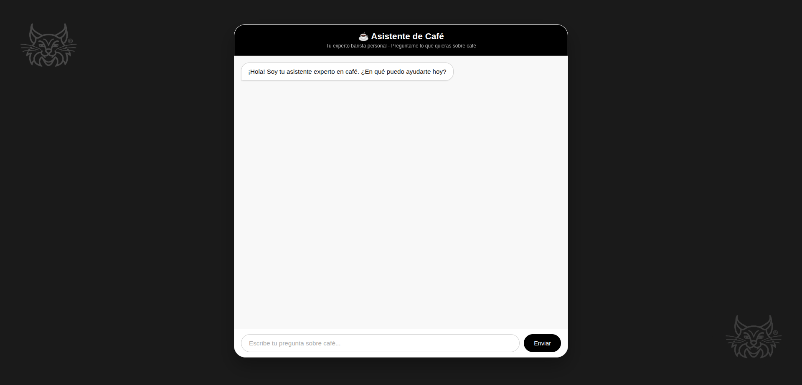

# ☕ CafBot: Asistente de Café con IA y RAG

**CafBot** es un chatbot inteligente y conversacional diseñado para una cafetería de especialidad. Su misión es guiar al cliente en la elección del café perfecto, recomendando productos de un catálogo real de más de 10 cafés con perfiles **Tradicional, Exótico y Funky**.

**¿Quieres probarlo?** 👉 [**Demo en vivo en Render**](https://chatbot-180426.onrender.com)

 <!-- (Opcional) Puedes añadir una captura de pantalla aquí -->

---

## 🚀 Arquitectura y Tecnologías

Este proyecto implementa una arquitectura moderna de IA híbrida, combinando la fiabilidad del código con la potencia de los LLMs.

| Componente             | Tecnología                                                                                                                                                                                                    | Propósito                                                                           |
| :--------------------- | :------------------------------------------------------------------------------------------------------------------------------------------------------------------------------------------------------------ | :---------------------------------------------------------------------------------- |
| **API Backend**        |                                                                                                                       | Framework web de alto rendimiento para construir la API del chat.                   |
| **Modelo de IA**       |                                                                                                          | GPT-3.5-turbo para entender el lenguaje natural y generar respuestas.               |
| **Base de Datos**      |                                                                                                    | PostgreSQL en la nube para persistir el historial de conversaciones.                |
| **Memoria Artificial** | `Python + `[](https://github.com/omnilib/aiosqlite)                                                | Gestiona el estado de la conversación (método/perfil) en un diccionario en memoria. |
| **RAG (Búsqueda)**     |  +                                                    | Implementa **RAG** para buscar en una base de conocimiento vectorial.               |
| **Frontend**           | HTML5, CSS3, JavaScript                                                                                                                                                                                       | Interfaz de usuario sencilla, responsiva y con diseño claro (modo claro/oscuro).    |
| **Infraestructura**    |  +  | Despliegue en la nube de la API y la base de datos.                                 |

### ⚙️ Funcionamiento Interno

1.  **Interfaz Web**: El usuario escribe su mensaje. El frontend envía una petición `POST` al endpoint `/preguntar` de la API.
2.  **Clasificación de Intenciones**: El backend recibe el mensaje. Un híbrido de reglas en **Python** y una llamada a **OpenAI** clasifica la intención del usuario (por ejemplo, `comprar`, `describir_cafe`, `saludar`).
3.  **Lógica de Recomendación**: Si la intención es `comprar`, el código Python gestiona un flujo de preguntas (método → perfil) para determinar qué café recomendar. El catálogo está definido en el código para evitar "alucinaciones".
4.  **Respuesta con RAG**: Si la intención es `describir`, se activa el **RAG**:
    - **Recuperación**: Se busca en **ChromaDB** (base de datos vectorial) la información más relevante sobre el café en cuestión.
    - **Generación**: La información recuperada se inyecta en un `system_prompt` y se envía a **GPT-3.5** para generar una respuesta descriptiva y natural.
5.  **Memoria**: Cada mensaje se guarda en **Supabase** y el estado de la conversación (método/perfil) se mantiene en la memoria RAM del servidor, permitiendo conversaciones coherentes.

## ✨ Funcionalidades Clave

- **Recomendación Inteligente y Libre de Alucinaciones**: El flujo principal de venta está gobernado por lógica en Python, lo que garantiza respuestas 100% fiables.
- **Descripción Detallada con RAG**: Para las preguntas sobre los cafés, el sistema utiliza **RAG** para buscar en su documentación interna y ofrecer respuestas precisas y completas.
- **Memoria de Conversación**: El bot recuerda el contexto de la conversación gracias al uso de **Supabase** y una memoria artificial en el servidor.
- **Interfaz Atractiva y Responsiva**: Un diseño limpio y moderno que funciona perfectamente tanto en ordenadores como en dispositivos móviles.
- **Despliegue en la Nube**: La aplicación está desplegada en **Render** y el código se aloja en **GitHub**, demostrando prácticas de desarrollo modernas.

## 🚀 Cómo Ejecutar el Proyecto Localmente

Sigue estos pasos para tener el asistente funcionando en tu máquina:

1.  **Clona el repositorio**:
    ```bash
    git clone https://github.com/lozanoMiguel/chatbot.git
    cd chatbot
    ```
2.  Crea y activa un entorno virtual:

    bash
    python -m venv venv
    source venv/bin/activate # En Windows usa: .\venv\Scripts\activate

3.  Instala las dependencias:

    bash
    pip install -r requirements.txt

4.  Configura las variables de entorno:

    Crea un archivo .env en la raíz del proyecto.

    Añade tus claves:

    text
    OPENAI_API_KEY="tu_api_key_de_openai"
    DATABASE_URL="tu_cadena_de_conexion_de_supabase"

5.  Indexa la base de conocimiento:

    bash
    python indexar_documentos.py
    (Este paso es crucial para que el RAG funcione. El script procesará los documentos de la carpeta documentos_cafeteria y creará el índice vectorial en chroma_db)

6.  Inicia el servidor:

    bash
    uvicorn app.main:app --reload
    (Abre http://localhost:8000 para empezar a chatear)
